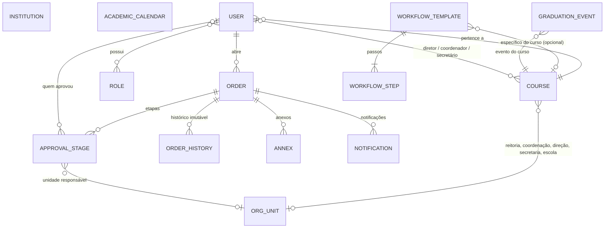

# GAP API

API REST do **GAP**, sistema de solicitações acadêmicas da UNIRIO. Ela centraliza o cadastro de instituições, cursos, unidades organizacionais, papéis e calendários acadêmicos, e fornece a base para que alunos abram solicitações (trancamento, inclusão de disciplina, histórico escolar etc.) que percorrem um fluxo de aprovação configurável por tipo de solicitação e por curso.


---

## Sumário

- [Visão geral](#visão-geral)
- [Stack](#stack)
- [Arquitetura](#arquitetura)
- [Modelo de domínio](#modelo-de-domínio)
- [Motor de workflow](#motor-de-workflow)
- [Autenticação e segurança](#autenticação-e-segurança)
- [Pré-requisitos](#pré-requisitos)
- [Configuração](#configuração)
- [Como executar](#como-executar)
- [Docker](#docker)
- [Testes e qualidade](#testes-e-qualidade)
- [Referência da API](#referência-da-api)
- [Padrão de respostas e erros](#padrão-de-respostas-e-erros)
- [CI/CD](#cicd)
- [Estrutura do projeto](#estrutura-do-projeto)
- [Estado atual e próximos passos](#estado-atual-e-próximos-passos)

---

## Visão geral

O que a API faz hoje:

- **Login institucional via Google (OIDC)**, restrito a domínios de e-mail permitidos (por padrão `edu.unirio.br` e `uniriotec.br`).
- **Cadastro complementar do usuário** após o primeiro login (matrícula e curso).
- **CRUDs administrativos** de instituições, cursos, unidades organizacionais, papéis (roles) e calendários acadêmicos.
- **Templates de workflow**: define quais etapas de aprovação (coordenação, direção, secretaria) cada tipo de solicitação percorre, com regra padrão da instituição e sobreposição por curso.
- **Motor de workflow** que, dada uma solicitação, instancia as etapas de aprovação resolvendo a unidade responsável a partir do curso do aluno.

---

## Stack

| Camada | Tecnologia |
|---|---|
| Linguagem | Java 21 (toolchain do Gradle) |
| Framework | Spring Boot 4.1.1 (Web, Data JPA, Validation, Security, OAuth2 Client) |
| Banco de dados | PostgreSQL (colunas `jsonb` para dados flexíveis) |
| Build | Gradle 9.7.1 (wrapper incluso) |
| Produtividade | Lombok, Spring Boot DevTools |
| Testes | JUnit 5, Spring Boot Test, Spring Security Test |
| Qualidade | JaCoCo (cobertura), SonarCloud, Gitleaks |
| Container | Docker (multi-stage, imagens Eclipse Temurin 21 Alpine) |

---

## Arquitetura

Aplicação em camadas, com pacote raiz `com.gap.api`:

```
Controller  →  Service (interface + implementação)  →  Repository  →  PostgreSQL
    │                      │
    └── DTOs (records)     └── Entidades JPA
```

- **Controller**: expõe os endpoints REST e valida a entrada com `@Valid`.
- **Service**: regras de negócio. Cada serviço de CRUD tem uma interface (`I*Service`) e uma implementação.
- **Repository**: interfaces Spring Data JPA.
- **Model/DTO**: `records` de request/response. As entidades não são expostas diretamente, o que evita referências circulares (por exemplo, `Course` ↔ `User`).
- **Exception**: `GlobalExceptionHandler` converte erros em um envelope padronizado.
- **Config / Filter**: configuração de segurança (OAuth2, CSRF, CORS).

---

## Modelo de domínio



### Entidades

| Entidade | Tabela | Descrição |
|---|---|---|
| `Institution` | `institutions` | Instituição (código/CNPJ único), provedor de autenticação (`LOCAL`, `CAFE_SHIBBOLETH`, `OAUTH2_CUSTOM`), provedor de assinatura (`NONE`, `GOV_BR`, `ICP_BRASIL`, `INTERNAL_CERTIFICATE`) e `settings` em JSON (cores, logo, textos). |
| `User` | `users` | E-mail único, nome, matrícula, curso e papéis. O cadastro é considerado completo quando há matrícula **e** curso. |
| `Role` | `roles` | Papel de autorização (implementa `GrantedAuthority`). |
| `Course` | `courses` | Curso com diretor, coordenador, secretário e cinco unidades organizacionais (reitoria, coordenação, direção, secretaria e escola). |
| `OrgUnit` | `org_units` | Unidade organizacional (`REITORIA`, `COORDENACAO`, `DIRECAO`, `SECRETARIA`, `DEPARTAMENTO`, `ESCOLA`). |
| `AcademicCalendar` | `academic_calendars` | Semestre (ex.: `2026.1`), datas, prazos e limites em `jsonb`, flag de ativo. |
| `Order` | `orders` | Solicitação do aluno, com tipo, anexos, dados específicos em JSON (`extraData`), etapas e histórico. |
| `ApprovalStage` | `approval_stages` | Etapa de aprovação de uma solicitação: tipo (`COORDINATOR`, `DIRECTOR`, `SECRETARY`), status (`PENDING`, `APPROVED`, `REJECTED`), ordem e unidade responsável. |
| `OrderHistory` | `order_histories` | Registro imutável (`@Immutable`) de eventos da solicitação. |
| `Annex` | `annexes` | Anexo de uma solicitação (URL, nome, content type). |
| `Notification` | `notifications` | Notificação para o usuário vinculada a uma solicitação. |
| `GraduationEvent` | `graduation_events` | Evento de colação de grau de um curso. |
| `WorkflowTemplate` / `WorkflowStep` | `workflow_templates` / `workflow_steps` | Definição do fluxo de aprovação por tipo de solicitação. |

### Tipos de solicitação (`Order.OrderType`)

`INCLUSAO_DISCIPLINA`, `EXCLUSAO_DISCIPLINA`, `APROVEITAMENTO_DE_DISCIPLINA`, `REVISAO_DE_PROVA`, `INTEGRALIZACAO_E_COLACAO_DE_GRAU`, `ATUALIZACAO_CADASTRAL`, `DECLARACAO_DE_MATRICULA`, `DECLARACAO_DE_CONTAGEM_DE_CREDITOS`, `EMISSAO_DE_HISTORICO_ESCOLAR`, `EMISSAO_DE_PROGRAMAS_DE_DISCIPLINAS`, `REGIME_EXCEPCIONAL_DE_APRENDIZAGEM`, `MIGRACAO_CURRICULAR`, `PRORROGACAO_PRAZO_INTEGRALIZACAO`, `CANCELAMENTO_MATRICULA`, `TRANCAMENTO_DE_MATRICULA`.

---

## Motor de workflow

O fluxo de aprovação de cada tipo de solicitação é **configurável por dados**, não fixo no código.

1. **Template**: um `WorkflowTemplate` liga um tipo de solicitação a uma lista ordenada de `WorkflowStep`. Cada passo define o tipo de etapa (`stageType`) e o tipo de unidade responsável (`responsibleUnitType`).
2. **Escopo**: se `courseId` for `null`, o template é o **padrão da instituição**. Se vier preenchido, é uma regra **específica do curso** e tem prioridade sobre o padrão.
3. **Unicidade**: só pode existir um template por combinação de (tipo de solicitação, curso) e um padrão por tipo de solicitação. Tentar duplicar retorna erro.
4. **Instanciação**: `WorkflowEngineService.instantiateWorkflowForOrder(order)`:
   - busca o template do curso do aluno; se não houver, usa o padrão; se também não houver, falha;
   - ordena os passos por `stepOrder`;
   - cria um `ApprovalStage` `PENDING` para cada passo;
   - resolve a unidade responsável (`COORDENACAO`, `SECRETARIA`, `DIRECAO`, `REITORIA` ou `ESCOLA`) a partir do curso do aluno.

Exemplo de template (padrão da instituição para trancamento de matrícula):

```json
{
  "orderType": "TRANCAMENTO_DE_MATRICULA",
  "courseId": null,
  "steps": [
    { "stepOrder": 1, "stageType": "COORDINATOR", "responsibleUnitType": "COORDENACAO" },
    { "stepOrder": 2, "stageType": "SECRETARY",   "responsibleUnitType": "SECRETARIA" }
  ]
}
```

---

## Autenticação e segurança

- **Login**: OAuth2/OIDC com **Google** (`spring-boot-starter-oauth2-client`).
- **Restrição de domínio**: `CustomOidcUserService` valida o domínio do e-mail (claim `hd` do Google, com fallback para o domínio do e-mail) contra a lista `app.security.allowed-domains`. Domínios fora da lista são rejeitados.
- **Provisionamento**: no primeiro login o usuário é criado com e-mail e nome; nos seguintes, o nome é atualizado. Matrícula e curso são preenchidos depois em `PUT /users/me/complemento`.
- **Sessão**: baseada em cookie `JSESSIONID`.
- **CSRF**: token em cookie `XSRF-TOKEN` (legível pelo JavaScript). Requisições que alteram estado (`POST`, `PUT`, `DELETE`) devem enviar o valor no header `X-XSRF-TOKEN`.
- **CORS**: libera apenas a origem configurada em `app.security.frontend-url`, com credenciais e métodos `GET`, `POST`, `PUT`, `DELETE` e `OPTIONS`.
- **Autorização**: todas as rotas exigem usuário autenticado. Hoje não há restrição por papel (role) nos endpoints; as roles estão modeladas e prontas para uso.
- **Redirecionamentos**: sucesso vai para `{frontend-url}/home`; falha para `{frontend-url}/login?error=unauthorized`; logout para `{frontend-url}/login?logout=true`.

Fluxo típico de login:

```
Frontend → GET  /api/oauth2/authorization/google
         → Google (consentimento)
         → GET  /api/login/oauth2/code/google   (callback)
         → redireciona para {frontend-url}/home
Frontend → GET  /api/users/me                    (verifica isCompletedCadaster)
Frontend → PUT  /api/users/me/complemento        (se o cadastro estiver incompleto)
```

---

## Pré-requisitos

- **JDK 21** (o Gradle também resolve o toolchain automaticamente via plugin Foojay)
- **PostgreSQL** acessível localmente ou em rede
- **Credenciais OAuth2 do Google** (Client ID e Client Secret) criadas no [Google Cloud Console](https://console.cloud.google.com/apis/credentials)
  - URI de redirecionamento autorizado em desenvolvimento: `http://localhost:8080/api/login/oauth2/code/google`
- **Docker** (opcional, para execução em container)

---

## Configuração

A aplicação usa perfis do Spring. O perfil ativo por padrão é `dev` (`application.yaml`) e pode ser trocado com `SPRING_PROFILES_ACTIVE`.

| Perfil | Banco | `ddl-auto` | Uso |
|---|---|---|---|
| `dev` | `jdbc:postgresql://localhost:5432/gap` (`postgres`/`postgres`) | `update` | Desenvolvimento local |
| `test` | `jdbc:postgresql://localhost:5432/core_api_test` (`testuser`/`testpassword`) | `create-drop` | Testes e CI |
| `prod` | Definido por variáveis de ambiente | `update` | Produção |

Em todos os perfis a API é servida sob o **context path `/api`** (porta padrão `8080`).

### Variáveis de ambiente

| Variável | Perfil | Descrição |
|---|---|---|
| `DEV_GOOGLE_CLIENT_ID` | dev, test | Client ID do Google |
| `DEV_GOOGLE_CLIENT_SECRET` | dev, test | Client Secret do Google |
| `GOOGLE_CLIENT_ID` | prod | Client ID do Google |
| `GOOGLE_CLIENT_SECRET` | prod | Client Secret do Google |
| `DB_URL` | prod | URL JDBC do PostgreSQL |
| `DB_USER` | prod | Usuário do banco |
| `DB_PASSWORD` | prod | Senha do banco |
| `ALLOWED_DOMAINS` | prod | Domínios de e-mail permitidos, separados por vírgula (ex.: `edu.unirio.br,uniriotec.br`) |
| `FRONTEND_URL` | prod | URL/origem do frontend (CORS e redirecionamentos) |
| `SPRING_PROFILES_ACTIVE` | todos | Seleciona o perfil (padrão: `dev`) |

> **Atenção:** nunca versione segredos. O `.gitignore` já ignora `.env`, e o pipeline roda o Gitleaks em todo PR.

---

## Como executar

```bash
# 1. Clonar
git clone https://github.com/GAP-UNIRIO/gap-api.git
cd gap-api

# 2. Subir um PostgreSQL local com o banco "gap" (exemplo com Docker)
docker run -d --name gap-db \
  -e POSTGRES_DB=gap -e POSTGRES_USER=postgres -e POSTGRES_PASSWORD=postgres \
  -p 5432:5432 postgres:latest

# 3. Exportar as credenciais do Google
export DEV_GOOGLE_CLIENT_ID="seu-client-id"
export DEV_GOOGLE_CLIENT_SECRET="seu-client-secret"

# 4. Executar
./gradlew bootRun

# TODO: Criar docker-compose para facilitar a execução local
```

A API fica disponível em `http://localhost:8080/api`. No perfil `dev` as tabelas são criadas e atualizadas automaticamente pelo Hibernate (`ddl-auto: update`).

Para gerar o JAR:

```bash
./gradlew clean build        # com testes
./gradlew clean build -x test
java -jar build/libs/*.jar
```

---

## Docker

O `Dockerfile` é multi-stage: compila com JDK 21 e executa em uma imagem JRE 21 Alpine, expondo a porta `8080`.

```bash
docker build -t gap-api .

docker run -p 8080:8080 \
  -e SPRING_PROFILES_ACTIVE=prod \
  -e DB_URL="jdbc:postgresql://host:5432/gap" \
  -e DB_USER="usuario" \
  -e DB_PASSWORD="senha" \
  -e GOOGLE_CLIENT_ID="..." \
  -e GOOGLE_CLIENT_SECRET="..." \
  -e ALLOWED_DOMAINS="edu.unirio.br,uniriotec.br" \
  -e FRONTEND_URL="https://seu-frontend" \
  gap-api
```

---

## Testes e qualidade

Os testes exigem um PostgreSQL com o banco e o usuário do perfil `test`:

```bash
docker run -d --name gap-test-db \
  -e POSTGRES_DB=core_api_test -e POSTGRES_USER=testuser -e POSTGRES_PASSWORD=testpassword \
  -p 5432:5432 postgres:latest

export SPRING_PROFILES_ACTIVE=test
export DEV_GOOGLE_CLIENT_ID="qualquer-valor-em-teste-local"
export DEV_GOOGLE_CLIENT_SECRET="qualquer-valor-em-teste-local"

./gradlew test          # roda os testes e gera o relatório do JaCoCo
./gradlew check         # testes + verificações
```

- Há testes de **controller** e de **service** para todos os módulos, além do tratamento global de exceções e do motor de workflow.
- O relatório de cobertura é gerado em `build/reports/jacoco/test/jacocoTestReport.xml` (o XML é o consumido pelo SonarCloud).
- Análise estática e quality gate pelo **SonarCloud** (`./gradlew sonar`, requer `SONAR_TOKEN`).

---

## Referência da API

Todas as rotas abaixo ficam sob o context path `/api` e exigem autenticação.

### Usuário

| Método | Rota | Descrição |
|---|---|---|
| `GET` | `/users/me` | Dados do usuário logado, incluindo `isCompletedCadaster` |
| `PUT` | `/users/me/complemento` | Completa o cadastro (matrícula e curso) |

```json
// PUT /api/users/me/complemento
{ "registrarionNumber": "202610012", "courseId": 1 }
```

> O campo de matrícula é grafado `registrarionNumber` no contrato atual da API.

### CRUDs

Os recursos abaixo seguem o mesmo padrão: `GET /recurso`, `GET /recurso/{id}`, `POST /recurso`, `PUT /recurso/{id}` e `DELETE /recurso/{id}`.

| Recurso | Base | Campos principais do corpo (`POST`/`PUT`) |
|---|---|---|
| Instituições | `/institutions` | `name`*, `code`*, `authProviderType`*, `signatureProvider`*, `settings`, `active` |
| Cursos | `/courses` | `name`, `directorId`, `coordinatorId`, `secretaryId` |
| Unidades organizacionais | `/org-units` | `type`, `name` |
| Papéis | `/roles` | `authority`* |
| Calendários acadêmicos | `/academic-calendars` | `semester`*, `startDate`*, `endDate`*, `deadlines`, `academicLimits`, `active` |

\* obrigatório.

Exemplos:

```json
// POST /api/institutions
{
  "name": "Universidade Federal do Estado do Rio de Janeiro",
  "code": "00000000000000",
  "authProviderType": "OAUTH2_CUSTOM",
  "signatureProvider": "GOV_BR",
  "settings": { "primaryColor": "#003366", "logoUrl": "https://exemplo/logo.png" }
}
```

```json
// POST /api/academic-calendars
{
  "semester": "2026.1",
  "startDate": "2026-03-02",
  "endDate": "2026-07-11",
  "deadlines": { "trancamento": "2026-04-10" },
  "academicLimits": { "maxCreditos": 28 },
  "active": true
}
```

As criações (`POST`) retornam **`201 Created`** com o header `Location` apontando para o novo recurso.

### Workflow

| Método | Rota | Descrição |
|---|---|---|
| `POST` | `/workflow-template` | Cria um template de workflow (ver [Motor de workflow](#motor-de-workflow)) |

### Autenticação (Spring Security)

| Método | Rota | Descrição |
|---|---|---|
| `GET` | `/oauth2/authorization/google` | Inicia o login com Google |
| `GET` | `/login/oauth2/code/google` | Callback do OAuth2 |
| `POST` | `/logout` | Encerra a sessão e remove `JSESSIONID` e `XSRF-TOKEN` |

---

## Padrão de respostas e erros

Todas as respostas usam o mesmo envelope:

```json
{
  "message": "Consulta realizada com sucesso.",
  "status": "success",
  "data": { }
}
```

| Situação | HTTP | Observação |
|---|---|---|
| Sucesso | `200` / `201` | `status: "success"` |
| Validação de campos (`@Valid`) | `400` | `data` traz um mapa `campo → mensagem` |
| `IllegalArgumentException` | `400` | Mensagem genérica `Invalid data` |
| Violação de integridade (duplicidade, registro em uso) | `409` | `status: "error"` |
| Recurso não encontrado | `404` | Via `ResponseStatusException` |
| Não autenticado | `401` / redirecionamento para login | Spring Security |

Exemplo de erro de validação:

```json
{
  "message": "Dados inválidos.",
  "status": "error",
  "data": { "name": "must not be blank" }
}
```

---

## CI/CD

Workflows em `.github/workflows`:

- **`pr-validation.yml`** (pull requests para `main` e execução manual):
  - sobe um PostgreSQL de serviço para os testes;
  - **Gitleaks** para detectar segredos expostos;
  - `./gradlew check sonar` com JaCoCo e quality gate do SonarCloud;
  - publica o resultado dos testes e o relatório de cobertura como artefato.
- **`building-docker.yml`** (push em `main`): compila o projeto, publica a imagem no Docker Hub (`latest` e o SHA do commit) e dispara o deploy no Render por webhook.
- **Dependabot**: atualização semanal das GitHub Actions.

Segredos e variáveis necessários no repositório: `SONAR_TOKEN`, `DEV_GOOGLE_CLIENT_ID`, `DEV_GOOGLE_CLIENT_SECRET`, `DOCKER_USERNAME`, `DOCKER_TOKEN`, `RENDER_DEPLOY_HOOK` e as variáveis `SONAR_PROJECT_KEY`, `SONAR_PROJECT_NAME`, `SONAR_ORGANIZATION_KEY`, `SONAR_HOST_URL`.

---

## Estrutura do projeto

```
gap-api
├── .github/
│   ├── dependabot.yml
│   └── workflows/
│       ├── building-docker.yml
│       └── pr-validation.yml
├── src/
│   ├── main/
│   │   ├── java/com/gap/api/
│   │   │   ├── ApiApplication.java
│   │   │   ├── Config/          # SecurityConfig (OAuth2, CSRF, CORS)
│   │   │   ├── Controller/      # Endpoints REST
│   │   │   ├── Exception/       # GlobalExceptionHandler
│   │   │   ├── Filter/          # CsrfCookieFilter
│   │   │   ├── Model/
│   │   │   │   ├── DTO/         # Requests/responses (records) e BaseResponse
│   │   │   │   └── Entity/      # Entidades JPA
│   │   │   ├── Repository/      # Spring Data JPA
│   │   │   └── Service/         # Regras de negócio
│   │   │       └── Interface/   # Contratos dos serviços
│   │   └── resources/
│   │       ├── application.yaml          # perfil ativo (dev)
│   │       ├── application-dev.yaml
│   │       ├── application-test.yaml
│   │       └── application-prod.yaml
│   └── test/java/com/gap/api/   # Testes de controller e service
├── Dockerfile
├── build.gradle
├── settings.gradle
└── gradlew / gradlew.bat
```

---

## Estado atual e próximos passos

**Já implementado**

- Login Google com restrição de domínio e cadastro complementar
- CRUDs de instituições, cursos, unidades, papéis e calendários acadêmicos
- Criação de templates de workflow e motor de instanciação de etapas
- Pipeline de CI com testes, cobertura, Sonar e varredura de segredos; deploy automatizado

**Modelado, mas ainda sem endpoints**

- Abertura e consulta de solicitações (`Order`), anexos, histórico e notificações
- Aprovação/rejeição de etapas (`ApprovalStage`)
- Eventos de colação de grau (`GraduationEvent`)
- Autorização por papel (roles) nas rotas

---
